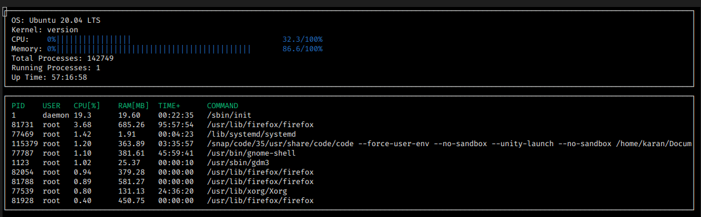

# SystemMonitor

## Dependencies

- **ncurses** Install on linux using `sudo apt install libncurses5-dev libncursesw5-dev`
- cmake >= 2.8
- make >= 4.1 (linux, Mac), 3.81 (Windows)
- gcc/g++ >= 5.4

## Build Instructions

- Clone this repo
- Run: `make build && ./build/monitor`
- Clean: `make clean`
